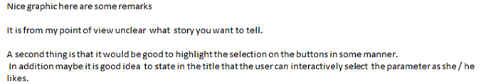

### Summary

This data-set is publicly available for research, it contains red wine samples.

The inputs include objective tests (e.g. PH values) and the output is based on
sensory data (median of at least 3 evaluations made by wine experts). Each
expert graded the wine quality between 0 (very bad) and 10 (excellent)

The visualization demonstrates quality distribution that most of the data (95%)
are medium quality, and shows the correlation between chemical properties
(citric acid) and quality, and give the viewer the option to explore other
interesting correlations.

The visualization can be viewed [here](http://htmlpreview.github.io/?https://github.com/abdelrahmansaud/redwine_visualization/blob/master/index_final.html)

 

### Design

I’ve chosen a histogram to demonstrate the bias in the data-set as I found it’s
suitable to compare values relative to a categorical variable, then added a
scatter plot to demonstrate the relationships between wine properties, and
colored it by quality to highlight the distribution across properties, this was
done in hoping to demonstrate the trends and correlations between different
variables (numerical) and quality, based on that I selected a scatter plot that
is colored by quality.

 

After collecting feedback I’ve added text to highlight that the buttons are
clickable, and added animation to the plot that highlights the correlation
between properties and quality, and make it clearer.

After another round of feedback, this time through project review, I
reconsidered the second chart, and decided to make it simpler and clearer, so a
simple line chart is chosen as it should be very effective in highlighting
trends, and changed the data in two ways

 

1- I displayed only the median for each feature, as this is enough to highlight
it’s correlation with quality

2- I removed some of the features from display as they didn’t have any clear
correlation

 

Citric Acid correlation with quality as the initial display, as it the strongest
correlation among other properties, and buttons of other properties of
interested are added that the viewer can click to explore other correlations.

Brief text is added to make it clear what quality numbers order is.

And to give the viewer an introduction of the data, a brief paragraph is added
for clarity.

 

### Feedback

Each point represents one person’s feedback, while persons 1 & 2 gave their
feedback in person, the third is from Udacity’s Nano Degree Forums

1- “The first chart is clear, but what is intended by the second chart?”

2- “I understand from this that the majority of quality is medium, however I’m
not sure what are you trying to highlight by the second chart”

3-

4- Project Review suggests that the visualization is lacking explanatory power

 

### Resources

[Dimple JS examples](http://dimplejs.org/examples_index.html)
